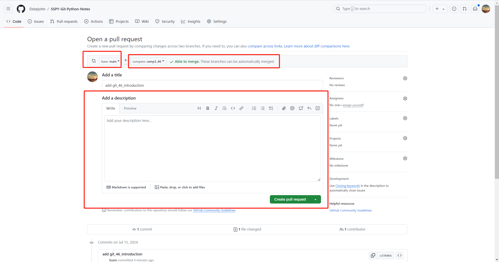

# Git知识

官网地址：[书生·浦语官网](https://internlm.intern-ai.org.cn/)    

InternLM-Github地址：[InternLM](https://github.com/InternLM)  

Git是一个开源的分布式版本控制系统，被广泛用于软件协同开发。程序员的必备基础工具。

官网：https://git-scm.com/

官方文档：[Git - Book](https://git-scm.com/book/en/v2)

Git 基础：[Git 基础知识](https://aicarrier.feishu.cn/wiki/YAXRwLZxPi8Hy6k3tOQcuwAHn5g)

# 一、笔记

## 1. Git 安装

### 1.1 **Windows 系统**

https://git-scm.com/download/win

选择适合您 Windows 版本（32 位或 64 位）的安装程序进行下载。


下载好了后，就是双击exe安装了，在安装向导中可选择默认设置（也可自定义安装路径和安装插件），即可完成安装。

检查安装是否成功

打开终端（win+r—>cmd）

输入指令检查 git --version


### 1. **Linux 系统**

通过包管理器安装 Git

```bash
sudo apt update
sudo apt install git
# 如果使用的 Intern-Studio 可以跳过或去除sudo后执行。默认已安装
```


开发机进去后可以选择VScode然后新建终端检查Git版本是否正确安装。


## 2. 常见的 Git 托管平台

### 2.1. **GitHub**

https://github.com/

- 是全球最大的代码托管平台之一，拥有丰富的开源项目和活跃的开发者社区。它提供了版本控制、项目管理、协作开发等功能，并支持多种编程语言。

### 2.2. **GitLab**

https://gitlab.com/

- 一个自托管或基于云的平台，提供了完整的 DevOps 工具链，包括代码托管、持续集成/持续部署（CI/CD）、问题跟踪等。

### 2.3. **Gitee**

https://gitee.com/

- 国内的代码托管平台，提供了代码托管、项目管理、协作开发等功能，对国内开发者来说，访问速度可能更快，也更符合国内的使用习惯。

**Github需要魔法，没条件的可以选择 Gitee 来使用。**

## 3. 常用的 Git 操作

1. `git init`

- 初始化一个新的 Git 仓库，在当前目录创建一个 `.git` 隐藏文件夹来跟踪项目的版本历史。

2. `git clone <repository-url>`

- 从指定的 URL 克隆一个远程仓库到本地。

3. `git add <file>` 或 `git add.`

- 将指定的文件或当前目录下的所有修改添加到暂存区，准备提交。

4. `git commit -m "message"`

- 提交暂存区的修改，并附带一个有意义的提交消息来描述更改的内容。

5. `git status`

- 查看工作目录和暂存区的状态，包括哪些文件被修改、添加或删除。

6. `git log`

- 查看提交历史，包括提交的作者、日期和提交消息。

7. `git branch`

- 列出所有本地分支。

8. `git branch <branch-name>`

- 创建一个新的分支。

9. `git checkout <branch-name>`

- 切换到指定的分支。

10. `git merge <branch-name>`

- 将指定的分支合并到当前分支。

11. `git push`

- 将本地的提交推送到远程仓库。

12. `git pull`

- 从远程仓库拉取最新的更改并合并到本地分支。

13. `git stash`

- 暂存当前未提交的修改，以便在需要时恢复。

14. `git stash pop`

- 恢复最近暂存的修改。

开始一个新的项目时，首先使用 `git init` 初始化仓库。在进行一些代码修改后，使用 `git add.` 添加所有修改，然后使用 `git commit -m "Initial commit"` 提交更改。

## 4. 配置

### 4.1 **如果是第一次使用的话，首先在开发机上使用git来设置全局用户名和邮箱**

1. **全局设置用户信息** 打开终端或命令提示符，并输入以下命令来设置全局用户名和电子邮件地址：

   ```python
   git config --global user.name "Your Name"
   git config --global user.email "your.email@example.com"
   ```

   

   这里的 `"Your Name"` 和 `"your.email@example.com"` 应替换为你自己的姓名和电子邮件。

2. **本地设置用户信息** 首先，确保你当前处于你想要配置的 Git 仓库的目录中。然后，输入以下命令来仅为该仓库设置用户名和电子邮件地址：

   ```python
   git config --local user.name "Your Name"
   git config --local user.email "your.email@example.com"
   ```

   

   同样，替换 `"Your Name"` 和 `"your.email@example.com"` 为该特定项目中使用的姓名和电子邮件。

使用下面命令可以查看用户名和邮箱

### 4.2 验证设置

在设置完用户信息后，你可能想要验证这些设置以确保它们被正确应用。

- **查看全局配置**：

  ```python
  git config --global --list
  ```

  

- **查看仓库配置**：

  ```python
  git config --local --list
  ```

  

- **查看特定配置项**：

  ```python
  git config user.name
  git config user.email
  ```

  

在团队工作中，完成自己的开发后，使用 `git push` 将更改推送到远程仓库，以便其他团队成员可以获取您的工作成果。

### 4.3 Git 四步曲

在Git的日常使用中，下面四步曲是常用的流程，尤其是在团队协作环境中。

**添（Add）**

- **命令**：`git add <文件名>` 或 `git add .`
- **作用**：将修改过的文件添加到本地暂存区（Staging Area）。这一步是准备阶段，你可以选择性地添加文件，决定哪些修改应该被包括在即将进行的提交中。

**提（Commit）**

- **命令**：`git commit -m '描述信息'`
- **作用**：将暂存区中的更改提交到本地仓库。这一步是将你的更改正式记录下来，每次提交都应附带一个清晰的描述信息，说明这次提交的目的或所解决的问题。

**拉（Pull）**

- **命令**：`git pull`
- **作用**：从远程仓库拉取最新的内容到本地仓库，并自动尝试合并到当前分支。这一步是同步的重要环节，确保你的工作基于最新的项目状态进行。在多人协作中，定期拉取可以避免将来的合并冲突。

**推（Push）**

- **命令**：`git push`
- **作用**：将本地仓库的更改推送到远程仓库。这一步是共享你的工作成果，让团队成员看到你的贡献。

帮助团队成员有效地管理和同步代码，避免工作冲突，确保项目的顺利进行。正确地使用这些命令可以极大地提高开发效率和协作质量。

## 4. 常用插件

在 VSCode 等软件中，插件是效率提升的利器。（根据自己的爱好进行选择）


| [GitLens](https://marketplace.visualstudio.com/items?itemName=eamodio.gitlens) | 在代码行上显示 Git 提交信息，如提交人、时间及变更描述等，还能查看文件历史记录、比较视图、显示 Git blame 注释和团队成员的最新活动等 |
| ------------------------------------------------------------ | ------------------------------------------------------------ |
| [Git Graph](https://marketplace.visualstudio.com/items?itemName=mhutchie.git-graph) | 类似于 SourceTree 的可视化版本控制插件，可用于查看提交记录、审视代码等 |
| [Git History](https://marketplace.visualstudio.com/items?itemName=donjayamanne.githistory) | Git 日志查看器，能轻松查看 Git 提交历史记录，支持显示不同颜色的分支、提交信息和更改详细信息，以及搜索提交历史记录； |

### 作业

接下来完成作业了

这里我就直接上基础步骤了，大佬可以自行操作下哈。

1.这里是合并到fork到[InternLM](https://github.com/InternLM/Tutorial)的过程，这是查询个人问卷星ID地址：[问卷星ID](https://www.wjx.cn/vm/PvefmG2.aspx?sojumpparm=MTU3NjczNzE1ODY=)

记住这里先fork到自己仓库哈，后面创建分支提交需要用到。

```python
git clone https://github.com/MrCatAI/Tutorial.git #修改为自己的
cd Tutorial/
git branch -a
git checkout -b camp3 origin/camp3
git checkout -b camp3_46 # 自定义一个新的分支
git add .
git commit -m "add git_46_introduction"
git push origin camp3_46
```


合并后后的PR链接：[合并拉去请求](https://github.com/InternLM/Tutorial/blob/camp3/data/Git/task/camp3_46.md)

2.首先就是建议自己创建个目录操作哈（**以下是合并到自己仓库代码哦**）

```python
# 创建文件夹
mkdir git
# cd 到指定路径下
cd git
# 将自己的github拉取到此目录下
git clone https://github.com/Dstarjohn/SSPY-Git-Python-Notes.git
# 列出远程分支
git branch -r
# 创建 camp3分支
git checkout -b camp3
# 这里我的仓库里没有canmp3分支，所以在远程仓库 origin 中创建一个新的分支 camp3 并将本地分支与之关联。这里可能会跳转验证github登录，自己输入账号密码即可
git push -u origin camp3
# 我检查下分支，列出本地分支和远程分支
git branch -a
# 自定义一个新的分支，camp3_<问卷星id>
git checkout -b camp3_46
# 创建自己的破冰自我介绍md文件，内容自己写，这里就不举例说明了。
torch camp_46.md
# 接下来就是标准的PR了
git add .
git commit -m "add git_46_introduction"
git push origin camp3_46
```


本地仓库PR截图




本地仓库的PR连接地址：[个人项目仓库and破冰介绍](https://github.com/Dstarjohn/SSPY-Third-python/blob/main/Tutorial/camp3_46.md)
